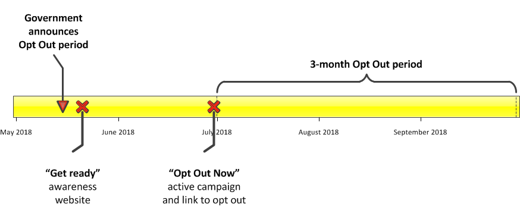

| |  |  |
| --- | --- | --- |
|     |     |     |
| **[What is an eHealth record?](context)** | **[I want info on MyHealth](history)** | **[Tell me how to OPT OUT](landing)** |
|     |     |     |

## My Health is proposed to change to an opt-out system in "late 2018". If you haven't opted out by the deadline, your information WILL be put into the system. There will be a three month window in which you can elect to opt-out but as there are incentives to have more and more data in this system, this will be the only opportunity.

## [OPT OUT WINDOW](window) | [OPT OUT NOW](landing)
